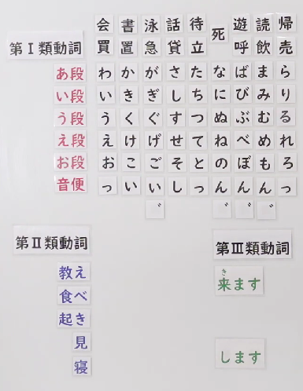

# 動詞
首先，根據變化的形態/方式，動詞可以分成三種：五段動詞、一段動詞、特殊動詞。  
其中，五段動詞數量最多，一段動詞常見的只有五個，特殊動詞只有兩個。

如下圖所示：

下面會針對各種動詞型態進行舉例說明。總共分成三大分。
1. 普通形的形 (非敬語態)
2. 敬語態的形
3. 可敬可不敬的形
4. 其他 (中性)(不敬也不非敬)

  

## 1. 普通形 --> 非敬語態
[現在肯定時態的普通形就是辭書形]()，除此之外，普通形還可以是現在否定，過去肯定，及過去否定。只要不是ます形就可以。

 

#### 五段動詞(第I類動詞)，例：売る

| 時態／語氣       | 普通形（常體） | 普通形變化類形 |
|------------------|----------------|----------------|
| 現在 肯定 | 売る           | 辭書形         |
| 現在 否定 | 売らない       | ない形         |
| 過去 肯定 | 売った         | た形           |
| 過去 否定 | 売らなかった   | なかった形     |

 

#### 一段動詞(る動詞)(第II類動詞)，例：教える  

| 時態／語氣       | 普通形（常體） | 普通形變化類形 |
|------------------|----------------|----------------|
| 現在 肯定 | 教える         | 辭書形         |
| 現在 否定 | 教えない       | ない形         |
| 過去 肯定 | 教えた         | た形           |
| 過去 否定 | 教えなかった   | なかった形     |

 

#### 特殊動詞(第III類動詞)，例1：来(く) る-->来(き) ます

| 時態／語氣       | 普通形（常體） | 普通形變化類形 |
|------------------|----------------|----------------|
| 現在肯定 | くる           | 辭書形         |
| 現在 否定 | こない         | ない形         |
| 過去 肯定 | きた           | た形           |
| 過去 否定 | こなかった     | なかった形     |

   

#### 特殊動詞(第III類動詞)，例2：する-->します  

| 時態／語氣       | 普通形（常體） | 普通形變化類形 |
|------------------|----------------|----------------|
| 現在 肯定 | する           | 辭書形         |
| 現在 否定 | しない         | ない形         |
| 過去 肯定 | した           | た形           |
| 過去 否定 | しなかった     | なかった形     |

參考[出口日語](https://youtu.be/R5HI0jxURz0?si=HAJyED5coFXPXIsF)

   

現在，來仔細看看普通形的現在式--辭書形  
### 辭書形 --> 會在字典裡看到的辭形
[現在肯定時態的普通形就是辭書形]()  

五段動詞(第I類動詞)：売る [最後是う段音]()  

一段動詞(る動詞)(第II類動詞)：教える [最後必是る]()  

特殊動詞(第III類動詞)：来(く) る、する[（就兩個）]() 

參考[出口日語](https://youtu.be/VXTA-hsnJEY?si=XsF3IwDC-J2jduBq)

 

### ない形(連體) --> 否定感
[現在否定時態的普通形就是ない形]()  

五段動詞(第I類動詞)：將最後的う段發音改成あ段發音  
例：売る --> 売らない  

一段動詞(る動詞)(第II類動詞)：把後面的る去掉，改成ない  
例：教える  --> 教えない  

特殊動詞(第III類動詞)：特殊變化，就兩個  
例：来(く) る --> 来(こ) ない、する --> しない

NOTE：「ある」的ない形是「ない」

 

### た形(連體) --> 過去感
[過去肯定時態的普通形就是た形]()  

五段動詞(第I類動詞)：將最後的う段發音改成音便段發音  
例：売る --> 売った  

一段動詞(る動詞)(第II類動詞)：把後面的る去掉，改成た  
例：教える  --> 教えた 

特殊動詞(第III類動詞)：特殊變化，就兩個  
例：来(く) る --> 来(き) た、する --> した

 

### なかった形(連體) --> 過去否定感
[過去否定時態的普通形就是なかった形]()  
[なかった形 是 ない形 + た形，因此直接參考ない形的變化即可]() 　

五段動詞(第I類動詞)：將最後的う段發音改成あ段發音  
例：売る --> 売らなかった 

一段動詞(る動詞)(第II類動詞)：把後面的る去掉，改成ない  
例：教える  --> 教えなかった  

特殊動詞(第III類動詞)：特殊變化，就兩個  
例：来(く) る --> 来(こ) なかった、する --> しなかった

NOTE：「ある」的ない形是「なかった」

    

## 2. ます形 (連體形) --> 敬語態
五段動詞(第I類動詞)：將最後的う段發音改成い段發音  
例：売る --> 売ります  
|         | 肯定     | 否定         |
|---------|----------|--------------|
| 現在    | 売ります | 売りません   |
| 過去    | 売りました | 売りませんでした |

一段動詞(る動詞)(第II類動詞)：把後面的る去掉，改成ます  
例：教える  --> 教えます  
|         | 肯定       | 否定           |
|---------|------------|----------------|
| 現在    | 教えます   | 教えません     |
| 過去    | 教えました | 教えませんでした |

 

特殊動詞(第III類動詞)：特殊變化，就兩個  
例：来(く) る --> 来(き) ます

|         | 肯定         | 否定               |
|---------|--------------|--------------------|
| 現在    | 来(き) ます   | 来(き) ません     |
| 過去    | 来(き) ました | 来(き) ませんでした|

 

する --> します
|         | 肯定     | 否定           |
|---------|----------|----------------|
| 現在    | します   | しません       |
| 過去    | しました | しませんでした |

    

## 3. 可敬可不敬的形
### 可能形 --> 能力形 (能做到...)
五段動詞(第I類動詞)：將最後的う段發音改成え段發音並加上る   
例：売る --> 売れる  

一段動詞(る動詞)(第II類動詞)：把後面的る去掉，改成られる OR れる  
例：教える  --> 教えられる

特殊動詞(第III類動詞)：特殊變化，就兩個  
例：来(く) る --> 来(こ) えられる、する --> できる

NOTE：可能形有敬語版。  
敬語版的可能形將把詞尾的る去掉，改成ます。因此等於只有變音而已。  

五段動詞(第I類動詞)：將最後的う段發音改成え段發音並加上ます  
例：売る --> 売れます  

一段動詞(る動詞)(第II類動詞)：把後面的る去掉，改成られます OR れます  
例：教える  --> 教えられます

特殊動詞(第III類動詞)：特殊變化，就兩個  
例：来(く) る --> 来(こ) えられます、する --> できます

 

### 受身形、被動形
五段動詞(第I類動詞)：將最後的う段發音改成あ段發音，加上れる  
例：売る --> 売られる  

一段動詞(る動詞)(第II類動詞)：把後面的る去掉，改成られる  
例：教える  --> 教えられる   

特殊動詞(第III類動詞)：特殊變化，就兩個  
例：来(く) る --> 来(こ) られる、する --> される

NOTE：受身形有敬語版。即把最後的る改成ます  
五段動詞(第I類動詞)：売られます  

一段動詞(る動詞)(第II類動詞)：教えられます   

特殊動詞(第III類動詞)：来(く) る --> 来(こ) られます、する --> されます

 

### 使役形
五段動詞(第I類動詞)：將最後的う段發音改成あ段發音，加上せる  
例：売る --> 売らせる  

一段動詞(る動詞)(第II類動詞)：把後面的る去掉，改成させる  
例：教える  --> 教えさせる

特殊動詞(第III類動詞)：特殊變化，就兩個  
例：来(く) る --> 来(こ) させる、する --> させる

NOTE：使役形有敬語版。即把最後的る改成ます  
五段動詞(第I類動詞)：將最後的う段發音改成あ段發音，加上せます  
例：売る --> 売らせます 

一段動詞(る動詞)(第II類動詞)：把後面的る去掉，改成させます  
例：教える  --> 教えさせます

特殊動詞(第III類動詞)：特殊變化，就兩個  
例：来(く) る --> 来(こ) させます、する --> させます

 

### 使役受身形 (被別人逼迫做...)
[如其名，使役受身形是 使役形 + 受身形 而來的]()  
將使役行後的る改成られる即可 --> せられる  
五段動詞(第I類動詞)：將最後的う段發音改成あ段發音，加上せられる  
例：売る --> 売らせられる  

一段動詞(る動詞)(第II類動詞)：把後面的る去掉，改成させられる  
例：教える  --> 教えさせられる

特殊動詞(第III類動詞)：特殊變化，就兩個  
例：来(く) る --> 来(こ) させられる、する --> させられる

NOTE：使役形有敬語版。即把最後的る改成ます  
五段動詞(第I類動詞)：將最後的う段發音改成あ段發音，加上せられます  
例：売る --> 売らせられます 

一段動詞(る動詞)(第II類動詞)：把後面的る去掉，改成せられます  
例：教える  --> 教えさせられます

特殊動詞(第III類動詞)：特殊變化，就兩個  
例：来(く) る --> 来(こ) させられます、する --> させられます

 

### 尊敬形
其變化與受身形完全一樣，只能依照前後文判斷到底是尊敬型還是受身形。  
五段動詞(第I類動詞)：將最後的う段發音改成あ段發音，加上れる  
例：売る --> 売られる  

一段動詞(る動詞)(第II類動詞)：把後面的る去掉，改成られる  
例：教える  --> 教えられる   

特殊動詞(第III類動詞)：特殊變化，就兩個  
例：来(く) る --> 来(こ) られる、する --> される

NOTE：尊敬形有敬語版。即把最後的る改成ます  
五段動詞(第I類動詞)：売られます  

一段動詞(る動詞)(第II類動詞)：教えられます   

特殊動詞(第III類動詞)：来(く) る --> 来(こ) られます、する --> されます

    

## 4. 其他 (中性)(不敬也不非敬)
### て形 --> 連接感
五段動詞(第I類動詞)：將最後的う段發音改成音便段發音  
例：売る --> 売って  

一段動詞(る動詞)(第II類動詞)：把後面的る去掉，改成た  
例：教える  --> 教えて 

特殊動詞(第III類動詞)：特殊變化，就兩個  
例：来(く) る --> 来(き) て、する --> して

 

### 意向形
五段動詞(第I類動詞)：將最後的う段發音改成お段發音並加上う  
例：売る --> 売ろう  

一段動詞(る動詞)(第II類動詞)：把後面的る去掉，改成よう  
例：教える  --> 教えよう

特殊動詞(第III類動詞)：特殊變化，就兩個  
例：来(く) る --> 来(こ) よう、する --> しよう

 

### 命令形
[命令形實際上很少用，因為很兇。]()  
[實操上都用てください。]()  
五段動詞(第I類動詞)：將最後的う段發音改成え段發音  
例：売る --> 売れ 

一段動詞(る動詞)(第II類動詞)：把後面的る去掉，改成ろ  
例：教える  --> 教えろ 

特殊動詞(第III類動詞)：特殊變化，就兩個  
例：来(く) る --> 来(こ) い、する --> しろ

 

### 禁止形
[禁止形實際上很少用，因為很兇。]()  
[實操上都用ないてください。]()   
五段動詞(第I類動詞)：最後的う段不變，加上な  
例：売る --> 売るな

一段動詞(る動詞)(第II類動詞)：把後面的る去掉，改成ろ  
例：教える  --> 教えるな 

特殊動詞(第III類動詞)：特殊變化，就兩個  
例：来(く) る --> 来(く) るな、する --> するな

 

### 条件形
五段動詞(第I類動詞)：將最後的う段發音改成え段發音，加上ば  
例：売る --> 売れば

一段動詞(る動詞)(第II類動詞)：把後面的る去掉，改成ろ  
例：教える  --> 教えれば

特殊動詞(第III類動詞)：特殊變化，就兩個  
例：来(く) る --> 来(く) れば、する --> すれば

   
---

Reference: [出口日語 YouTube Channel](https://www.youtube.com/@deguchi)