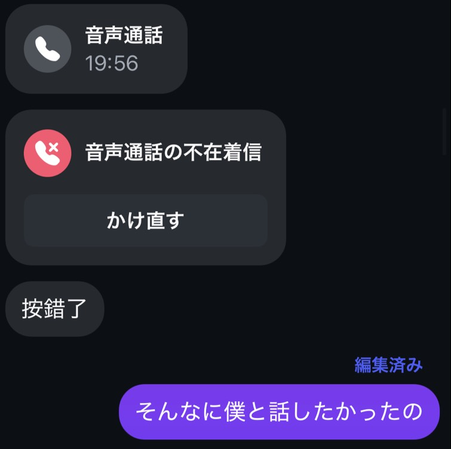
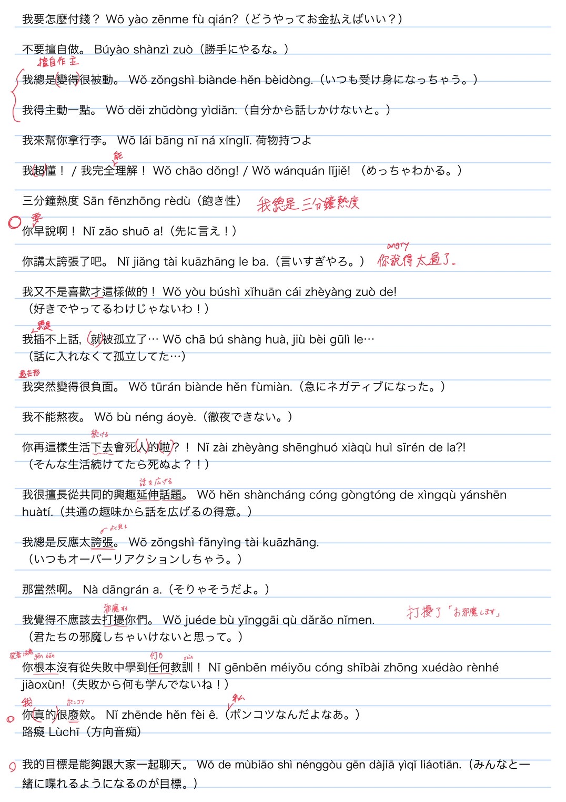
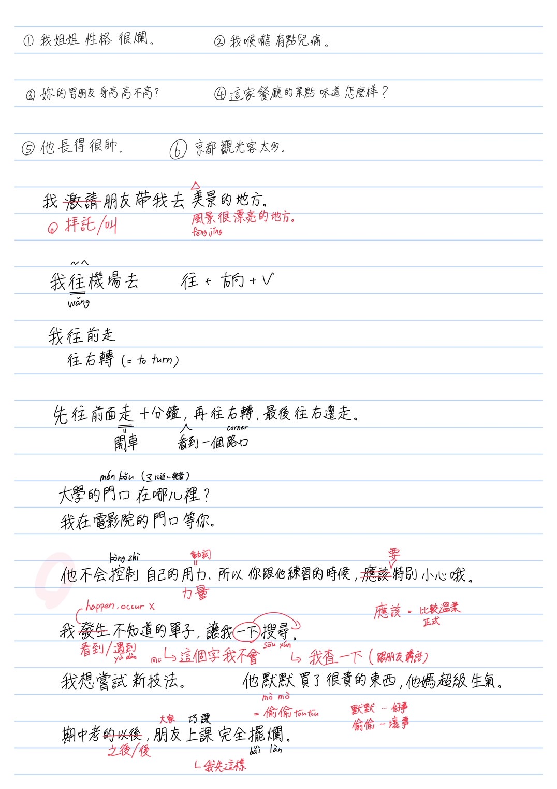

## 中文的部分
#### 我要怎麼付錢？
> OK  
> これは「どうやってお金を払っていいの？」の意味です。  
台湾に色々な払い方があるから。

#### 不要擅自做。
>  「要擅自作主！」の方がよく使う。  

#### 我總是變得很被動。
> 「我總是（變得）很被動。」  
> 「變得」を取っても大丈夫だよ。  
> 「變得」は「なる」の意味ですから、「元々こんなんのじゃなくて、今こんなふうになっちゃった。」の意味あがある。  

#### 我得主動一點。
> OK

#### 我來幫你拿行李。
> OK
 
#### 我超懂！ / 我完全理解！ --> 分かるわ！
> 「我懂！」だけでいい。「超」を取って。  
> 「我超懂！」はちょっと面白く自信満々な表し方です。  
例えば、「這要怎麼辦啊? 你會做嗎?」「我超懂！」  

> 「我完全能理解！」の方がいいです。  
> 「能」を接続して方がいい。

#### 三分鐘熱度
> OK  
> 文に入れたかったら、「我總是三分鐘熱度」です。

#### 你早說啊！
> OK  
> 「早說啊！」と「你怎麼不早說？」もよく使う。

#### 你講太誇張了吧。 --> 友達の冗談の度が過ぎる場合。
> OK。これはちょっとツッコミっぽい言い方です。もし友達は空気を読めると、これが充分です。  
> 「你說的太過了！」もよく使うね。これはやっぱり怒る言い方です。厳しいです。

#### 我又不是喜歡才這樣做的！
> OK

#### 我插不上話，就被孤立了...
> OK  
> でも「我插不上話，被孤立了...」も大丈夫。この状況、「就」は任意だ。  
> 悲しいね。大丈夫？

#### 我突然變得很負面。
> OK  
> ちなみに、「我會突然變得很負面。」もいいです。「會」を接続する。  
> でも意味はちょっと違う。「會」は条件形です。「～的話，我會~」（～なら、私は～）

#### 我不能熬夜。
> OK  
> でもこれはちょっとおかしい。僕がこれをきいたら、「えっ、なぜできないの？」と思う。  
> だから、「我不想熬夜。」の方がもっと自然です。「不想」は「したくない」です。

#### 你再這樣生活下去會死人的啦？！
> OK  
> でも、ちょっと具体すぎだ。  
> 「你再這樣下去會死的！」。これは充分です。

#### 我很擅長從共同的興趣延伸話題。
> OK

#### 我總是反應太誇張。
> 最初は気付かなかった。でも、よく考えてみたら、ちょっとおかしいと思う。  
> 「我的反應總是太誇張。」の方がいいです。

#### 那當然啊。
> OK  
> 「当たり前だ」の意味です。

#### 我覺得不應該去打擾你們。
> OK 

#### 你根本沒有從失敗中學到任何教訓！
> OK  
> でも、厳しいね。

#### 你真的很廢欸。
> OK  
> 「你很廢欸。」だけの方がよく使う。

#### 路癡
> OK  
> ちなみに、「痴」と「癡」は同じことです。両方ともよく使う。少なくとも、僕的に。  
> 例えば、「我是路痴」、「我是超級大路痴」

#### 我的目標是能夠跟大家一起聊天。
> OK   
---

#### 我姐姐性格很爛。
> OK  
 
#### 我喉嚨有點兒痛。
> 「我喉嚨有點痛。」だけの方がいいです。「兒」を取った方がいいです。  
> 「兒」を接続したら、中国人っぽくなる。
> 

#### 你的男朋友身高高不高?
> 「你男朋友身高高不高?」だけも大丈夫。「的」を取る。必要がない。

#### 這家餐廳的菜點味道怎麼樣?
> 分かるけど、中国人っぽい。  
> 「這家餐廳好吃嗎?」の方が自然です。

#### 他長得很帥。
> OK  
> 「他很帥。」も大丈夫。

#### 京都觀光客太多。
> OK  
> でも、もしこれは全部だったら、「京都觀光客太多了。」の方が自然だと思う。  
> 「了」を接続する。

#### 我邀請朋友帶我去美景的地方。
> 「我請朋友帶我去漂亮的地方。」  
> 「美景」はすでに「綺麗なところ」だから、「美景的地方」は「綺麗なところのところ」。おかしい。  
> もしくは、「我請朋友帶我去看美景。」は完全にできるよ。

#### 我往機場去
> 不自然  
> 「我正在前往機場」です。

#### 我往前走
> 不自然  
> これは命令形です。自分を命令することです。  
> 「我正在往前走」はオケ。  
> もしくは「你往前走」はいいです。

#### 我往右轉
> 前の同じ概念です。 
 
#### 先往前面走十分鐘，再往右轉，最後往右邊走。
> OK 

#### 大學的門口在哪裡?
> OK

#### 我在電影院的門口等你。
> OK 

#### 他不會控制自己的用力，所以你跟他練習的時候，應該特別小心哦。
> 「他不會控制自己的力氣/力量，所以你跟他練習的時候，要特別小心哦。」  
> 「用力」は動詞。「力氣/力量」は名詞です。  
> 「應該」はちょっとフォーマルすぎる。  
> ちなみに、「哦」と「喔」は同じことです。

#### 我發生不知道的單字，讓我一下搜尋。
> 「發生」は「発生」です。同じ意味だと思う。「HAPPEN」  
> 「遇到」の方がいい。  
> 「搜尋」はちょっとフォーマルすぎる。  
> だから、「我遇到了不會的單字，讓我查一下」  
> でも、実際には「這個字我不會，讓我查一下」の方が一番使うのだ。

#### 我想嘗試新技法。
> OK 

#### 他默默買了很貴的東西，她媽超級生氣。
> 「她偷偷的買了很貴的東西，現在他媽媽超生氣。」のはいいです。  
> 「默默」はいいことです。例えば、「他在默默的幫助別人。」  
> そして、中国語は時制じゃないから、時間点を表す言葉は重要なんですね。

### 期中考的以後，朋友上課完全擺爛。
> 「期中考之後，大家上課都完全擺爛。」  
> 「時間点+之後」はテンプレートです。大事だ。

---

## 日本語の部分
じゃあ、いつもの自己紹介ですね。  
僕は○○です。  
学部はコンピューターサイエンスです。今は五年生です。  
今日は2025年12月05日（いつか）の午前------です  

今日は本気で日本語を勉強して59（ごじゅうきゅう）日目です。（10月7日(なのか)から。これは拓真さんと初めて二人だけchat cornerに会話した日ですね）  
シャドーイングを始めて36日（さんじゅうろくにち）目です。（10月31日から）  
英語を始めて1523（せんごひゃくにじゅうさん）日目です。（2021年10月4日(よっか)から。初めてchat cornerに行った日からね。）  

○○さん、もし画面に何か間違いがあったら、是非教えてくださいね。  
でも、ストレスを感じないてくださいね。  
今の僕の目標は完全に正しく話すことじゃなく、自分の考えを流暢に話せることが一番重要なんですね。  
あ、そして、ゆっくり話してくださいね。  

始める前に、一つ話したいことがあるんだけど  
あの、もし補充（ほじゅう）したい単語があったら、文字だけ送ってくれればいいです。振り仮名は書かなくて大丈夫です。僕はパソコンを使ってるんですから。自分で振り仮名を調（しら）べればいいよ。  
でも、すぐに送ってね。一つあったらひとつずつ送って。練習が全部終わってからまとめて送らないで欲しい。   

今日は、言語を勉強してきた経験を少しお話ししたいと思う。  
じゃあ、一つ（ひとつ）目のは、勉強って、本当に筋トレみたいだね。頭も筋肉みたいなものだし。つまり、勉強はけがして、それが治ると、強くなることです。だから、勉強は伸びる一方じゃなくて、時々下（さ）がることもある方が自然です。下がる原因は、頭をけがしていることです。成長曲線（せいちょうきょくせん）はだいたいこんな感じ：  

知識量が突然下がる場合、大体 ~もしくは~ この状況です。焦（あせ）らないでください　~落ち着いてください。~  
それに、別の角度（かくど）から見ると、勉強は短期間（たんきかん）で身（み）につくものじゃなく、長期間（ちょうきかん）かけて積（つ）み重（かさ）ねるものだ。なぜなら、物理的に短期間（たんきかん）で怪我が治ることは不可能だね。例えば、週に3日（みっか）3時間勉強するより、毎日30分（っぷん）ずつ勉強したほうが効果（こうか）的だ。  
ちなみに、僕の日本語は今下がってるよ。クソ。  

そして、もし勉強をトレーニングだと考えるなら、色々なトレーニングは必要なんですね。  
シャドーイングを例に挙げると、「シャドーイング」この練習は野球の練習だと考えるなら、「長い動画をシャドーイングする」は一般的な野球の訓練です。でも、時々専門的な訓練も必要だ。この時、「アニメみたいな中二的なシャドーイング」は筋トレですね。  
つまり、幅（はば）広い（ひろい）けど浅い（あさい）トレーニングも大事だし、一方で幅（はば）は狭い（せまい）けど精度（せいど）が高いトレーニングも重要だ。  
  
## 別の質問：
### 僕のメッセージ「そんなに僕と話したかったの？」は正しいですか？それとも、「そんなに僕と話したいの？」のが正しい？
> ちなみに、「彼は僕に電話を掛けた」と「電話をした」両方ともいいです。  
> 「彼は僕に電話を掛けた、僕が出なかった」(當時沒接到)、「僕が出れなかった。」(當時無法接聽)  

>どっちもいいし。  
でもマジで言うと、過去形の方が一番正しいです。  

### （今はまだ変です）最近、インスタのフィードが変になった。→これ、過去形だけど、今の状況をあらわすことができる？
> 「なってる」と「なった」どっちもいいです。同じです。  

### [このリール](https://www.instagram.com/p/DQSYxV8k_jk/?hl=en)を見ましたか？　このユーモア、日本人にとって分かる？
> $\color{#FF0000}{あの友達が「ごめん」でよかった。もし松本聖波だったら、きっとめっちゃ怒ってたね。}$  

> ○○さんが「自分が分かるけど、他の人にとって分かるかどうか分からない。」と言った。

### これ、「未開人」で呼んだら、失礼ですか？
> 「未開人」は差別用語じゃない？  
「差別用語（さべつようご）」は discriminatory terms  
多分ね。  
ちょっと調べてみわ。  
えっ、大丈夫そう。  
でも、使わない方がいいです。  
「原住民」の方がいいです。  

### さっき、最初の「言語を勉強してきた経験」の「言語」はいいですか？それとも「語学（ごがく）」の方がいいですか？
> 「言語」の方がいいですね。  
あっ  
でも、「語学」もいいですね。  
どっちもいいです。  

### 「メガネを作る」それとも「メガネを買う」？
> どっちもいいです。  
「作る」を言うと、「メガネのレンズの強さを変える」の意味です。

### 「コンタクトを作る」それとも「コンタクトを買う」？
> 「コンタクトを作る」は絶対に言わない。聞いたことがない。絶対に言わない。  

 

じゃあ、今日は以上だ。  
将来の練習は僕が同じ話題をいくつか繰り返すね。  
繰り返しは重要だと思う。  

## 他のコメント：  
### How do say "This is confusing"?
> えぇぇぇ、難しいな...  
そうなの言わないと思う。  
日本語だと人間が主語になることがほとんど。  
英語から日本語に訳（やく）すのって大変なんだよ。  
だから、「僕はちょっと混乱してきた。」の方がいいです。  

> GPT：「ちょっと」は十分重要だ。「混乱」だけなら、随分やばい状況が入ってる。

### 怪我をして、それが治ると、体が強くなることは勉強も同じです

### もし伸びてないと感じても、焦らないでください
> ~知識量が突然下がる場合、大体この状況です。焦（あせ）らないでください~   

### 怪我を治す
> Someone heals my wounds

### 怪我が治る
> The wounds heal on its own

### これ読んでもらえる？
> 可以說給我聽嗎?

### もう１回言ってみるね
> 我想再講一次看看

### スクショ
> Screenshot

-----

以下は○○さんのノートの写真です。ご参考までに。

