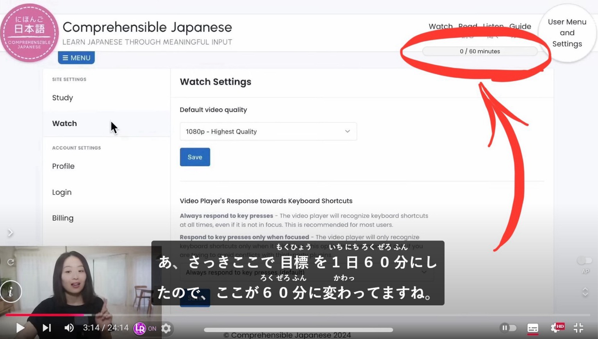

## 我的提問

我突然發現日文的「~ている」可以有兩個意思  
一個是現在進行式  
一個是該動作已經結束了，現在則只是保持在該狀態

那麼問題就來了
如果你看到 「世界の気候が変わっている」

你要怎麼知道他是正在變化還是已經變化了？  
是「氣候一直在變化」還是「氣候已經變了」？ 

---

僕は“ている”の意味の曖昧さに気づきました。  
例えば、“気候が変わっています“。  
この文の意味は　“気候が変わりました。そして、今はその変わった気候です。それ以上の変更はありません。” と解釈できます。  
同時に、“気候がずっと変わり続けています” とも解釈できます。  
だから、文脈によって判断するしかないと思います。  

以上は僕の判断です。正解の自信がありません。誤解があるかもしれません。だから、先生に助けを求めます。

## 黑白的回答

很正確的理解

首先變化這個動詞我認為很難明確定義時態，比起像是英文著重時間性的表達，我比較偏向解釋為這句話的重點在變化的動作還是變化的事實
「気候が」的話比較著重在變化這個動詞上，所以意思會更接近於氣候的變化在進行著。  
但如果今天是「気候は」的話，意思更接近於已經變了的這個事實

不過會有這樣的結果是因為「が」的話氣候變成主語了，有點主動的感覺，但氣候我認為是被動的改變，所以我會以は的敘述為主

比起說是用上下文判斷，其實就是根據情況判斷。另外，如果是這樣的語句，其實日文為了鞏固表達的意思有很多有的沒的可以加，一直在變化：氣候は　常に/今でも／いつも　変わっている，已經改變了：気候は　もう／すでに　変わっている。  
單純這樣看的話，持續在改變算是進行式也算是保持改變的狀態，我倒會覺得他同時滿足兩個意思

話說
変更->変化，變更是主動的。(但純粹語意來說我認為並不是已經改變不會再變，而是 不是「開始」改變而已）

## 我又問

我剛剛查了一下確實は が會影響到意思

這我還真的沒注意到
不過對於這點

我在想是不是日本人平常在講話的時候也不會怎麼注意，然後可能不小心用錯，原本應該要用は，卻用成が
我昨天會有這個問題是因為我昨天在看一個叫日文的影片

他就在設定一個網站，一邊設置、一邊用很講單的日文描述他的動作

其中他有把網頁上的學習時間從30分鐘改成60分鐘

之後他就看到系統上確實改成60分鐘了，於是就說「さっきここで目標を1日60分にしたので、ここが60分に変わってますね」

我看到後就覺得很奇怪，為什麼最後要用ます，現在式
https://youtu.be/NebtveWRFGM?si=f9XpIwnl3f-YNE1b&t=194  
這個，我已經有標注時間了
嘛
不過我覺得我說這些都有點多餘了
總之只是想分享一下我的思路而已

## 黑白繼續回答

是,很多時候會忽略小錯誤  
這個就是了,你說的狀態的維持  
他的全文應該要是  
変わっています＝変わっている  
表示剛才已經改好.現在維持著改好的狀態  
が勉強可以理解,因為他是改了設定,顯示的部分自動(看成主動)變成了60分  
我可以接受  
(不是直接改顯示,而是改了設定的因果造成的->間接干涉使他自己變換)  
因為你是直接看日常使用學習，可能會覺得怎麼這個也省略那個也省略很奇怪  
但換一個方向想，因為很多省略後長得很像，所以用起來其實不太容易有問題，只是我們外國人的角度會把它解釋成文法正確的，本地人根本不會管（這個你懂）      

