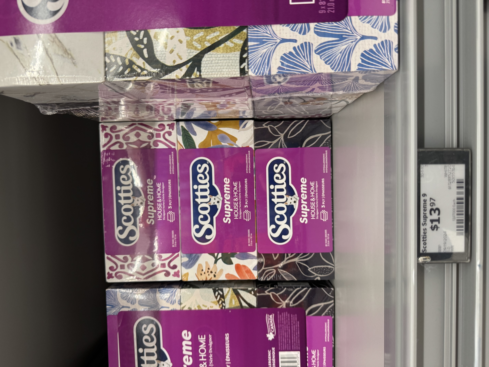

# Day 1
### 僕と
僕の日本語はほとんどアニメから学んだから、剣と魔法の日本語がもっと知っている  
ラクウンは僕の寮の近くのゴミ箱の中に赤ちゃんを出産した  
「の」がいっぱいだな

### 黑白回
それはあかん  
たまに「僕の」を省略しても、主語がわかるからいいと思う  

### 僕と
あは  
そうですね  
今度気を付ける  
そう  
僕もそう思う

# Day 2
### 僕と
カナダにこんなようなクソデザインがたくさんある

例えば、これ、いくら見てもこれが何なのか分からなかった

### 黑白回
このような　と　こんな　は一緒、どっちかを使えばいいよ  
なんか地味に傷ついた

### 僕と
そんなにクソなデザインは、まるで「あんたなんか買いまさなくてもどうでもいいよ」と言っている

### 黑白回
こんなくそデザインはまるで「あんたが買うか買わないかどうでもいい」と言っている  
買うかどうか勝手にしろ  
買うかどうか知らない    
這些可以代換  

### 僕と
我剛剛問GPT  
我發現我原本的寫法也拼錯了  
應該是拼成 あんたなんか買わなくてもいいよ  

### 黑白回
444
あんたに買われたくない  
這種比較過分   
更多用在嗆人:輪不到你來說我  
あんたに言われたくない  
あなた＝あんた  
お前に言われたくない  

## TIL
この(這個) ような(樣子) --> 二選一
Fixed --> こんなくそデザインはまるで「あんたが買うか買わないかどうでもいい」と言っている 

# Day 3
### 僕と
僕は友達に IELTS ライティングを教えている。

昨日、二時間半授業をした。すると、「最近の授業はめちゃくちゃうまかったよ、いっぱい勉強した。正直、今の報酬は実に少なすぎると思う。だから、三時間のお金を払うよ。」と友達は言った。

大きな額ではないけど、すごく満足した。

これ、お金の問題じゃなくて、気持ちの問題なんだ。

### 黑白回
ライティング感覺很少用
會用非外來語居多
但沒差

勉強になった --> 學到了很多  
勉強した 學了(學習這個行為)很多  

三時間分のお金 比較好  
三小時錢 --> 三小時份的錢  

不過都看得懂owob
其他沒什麼大問題

## TIL
Fixed --> 
僕は友達に IELTS ライティングを教えている。

昨日、二時間半授業をした。すると、「最近の授業はめちゃくちゃうまかったよ、いっぱい[勉強になった]()。正直、今の報酬は実に少なすぎると思う。だから、[三時間分のお金]()を払うよ。」と友達は言った。

大きな額ではないけど、すごく満足した。

これ、お金の問題じゃなくて、気持ちの問題なんだ。

# Day 4
### 僕と
先週は今学期の最後の週だったので、宿題がたくさんあった。だから、日本語の練習をしなかった。

できれば、今から毎日こういう文を書きたい。

### 黑白回
日記はもともと習慣がなかったから、続けるのは努力が必要なんだけど  
最近の出来事、又はニュースに対して、日本語で自分の意見を語るのもいいと思う  

# Day 5
### 僕と
そうですね。いい方法だね。  
もしアイディアが何もない場合、ニュースがテーマになるよ。  

でも、今日はアイディアがあるよ。  

シャドーイングはスピーキングの練習方法の一つだ。  
シャドーイングはすごく効果的だと思う。それに、シャドーイングはとても面白い。まるで画面の中のキャラクターになりきっているみたいだ。 

↑↑ これだ！

### 黑白回
前めっちゃ中二病みたいにアニメ真似してるとこ思い出したw
あれやりすぎたらお前リアル世界のナルトになるぞ

### 僕と
それもつよいかも。いろいろに。

# Day 6
### 僕と
僕はまず、自分でGoogle 翻訳で言葉を探す。それから、一般的な文を書く。最後にChatGPTと話し合う、最も良い文を決める。だから、間違いはそんなに多くない。

### 黑白回
そうなると、どこまでスムーズに表現できるかが次の課題ですね

# Day 7
### 僕と
そうですね。いい問題だ。
ま、なんとかなるよ〜

僕の伯母は、以前米国の大学で学んでいたので、英語が上手です。
4年前くらいに、僕は伯母に毎日英語の日記を書いて送っていた。そして、伯母は日記を訂正して、僕に返してくれていた。最初から最後まで、ちょうど百日続いた。
言いたいのは、実は、中期後半から僕が訂正をあまり見なかったということです。訂正を見るつもりだったけど、モチベーションの方が一番ためになったんだと思った。この毎日英語で日記を書くという行為自体が、より役に立つと思った。
伯母さん、本当にありがとうございました。そして、ごめんなさい！

### 黑白回
用学ぶ要解釋學什麼比較好
僕は英語で書かれた日記を毎日伯母さんに送って、そしてそれを伯母さんが文を訂正してから僕に返信してくれた。
言いたいのは這邊沒有文法的問題，但我覺得不論中文還是日文「我想說的是」這句話一直都很冗贅
伝えたいのは會更好
日記に訂正すべき所がすごく減りました
訂正を見る開始有點不理解意思
感覺你漏句子了
翻成中文應該怪怪的：原本是打算看被訂正的地方，？？？？，動力應該是最主要的原因
4個問號那裡你可能想說些什麼
然後最後幹嘛道歉www
この毎日英語で日記を書くという行為自体が、より役に立つと思った。這句我覺得還不錯

### 僕と
確實這句我掙扎了蠻久的

？？？？的地方是 「但後來 "變成" 覺得這個讓我持續寫下去的動力本身才是最有用的」 中的 「變成」
所以我後面才會用 「なった」
真要說的話應該要是 「後來慢慢地覺得」 之類的?
你是說第一句我不應該用 学ぶ 嗎?
因為 学ぶ 通常是 "學習了一個具體的東西"
但是我姑姑的例子只是說他在美國讀過書，並不是特別學了英文，所以用 学ぶ 怪怪的

真要說的話，"僕の伯母は、以前米国の大学で勉強していたので、英語が上手です。"才對，用 勉強する 才好。

你的意思是這樣嗎?

### 黑白回
我的話可能會直接用留學
簡潔
～の方が為になった
逆に、～の方が為になった
相反的（conj.）逆に
感覺你會用到
想了一下，感覺跟英文一樣。能以一個高級或精準一點的詞彙表達就會儘量使用，減少不必要的敘述（？

# Day 8

